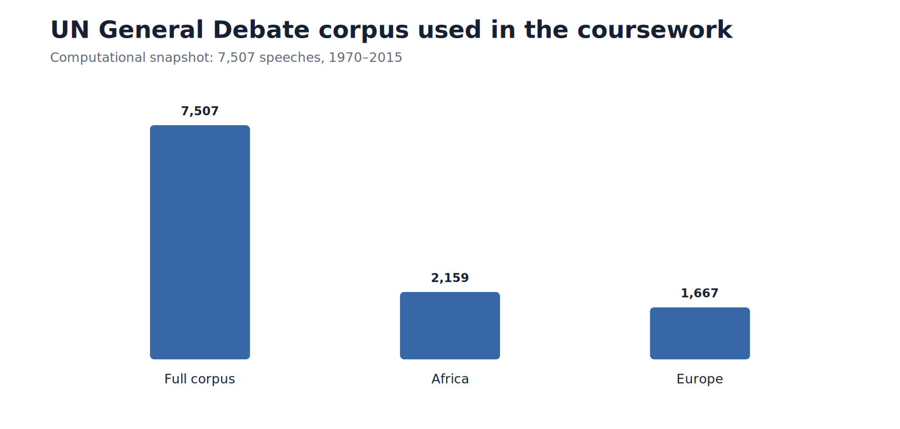
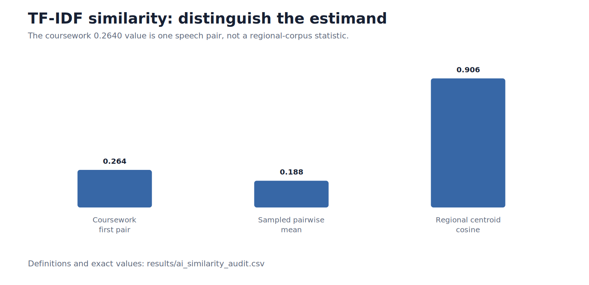
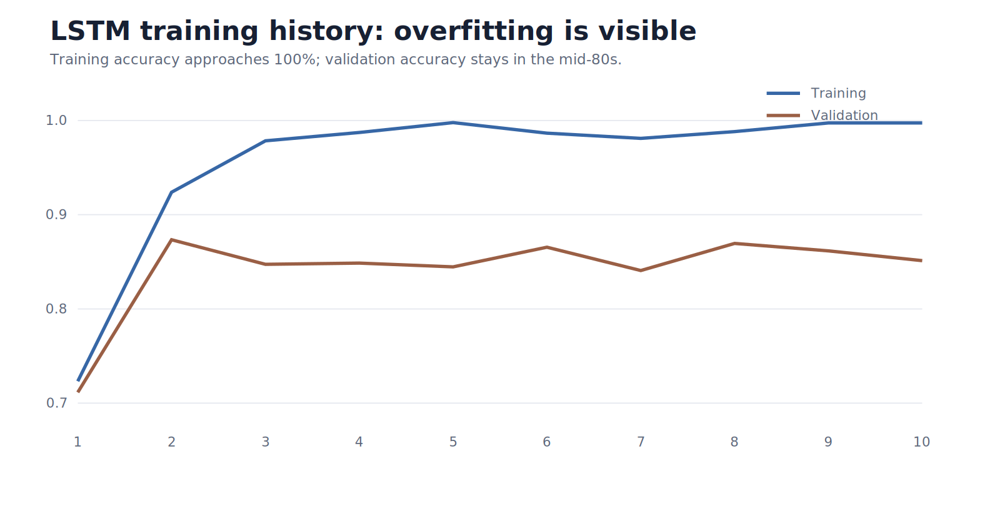

# UN General Debate NLP & Machine Learning

**Africa–Europe comparison with an Africa-focused topic-modeling and network-analysis extension**

This repository combines two master's coursework projects using the **United Nations General Debate Corpus (UNGDC)** into one research progression:

1. **AI course foundation — Africa vs Europe:** EDA, regional vocabulary, TF-IDF/cosine similarity, LDA, K-means, LSTM classification and VADER sentiment.
2. **Social Media & Web Analytics extension — Africa:** deeper EDA, sentiment analysis, LDA/NMF/BERTopic and country-mention network analysis.

> **Provenance:** coursework-reported results are kept distinct from professional reconstructions and methodological corrections. The live portfolio figures below are validated PNG renderings generated from clean repository sources so they display reliably on GitHub.

For the full technical discussion, see **[Models, measurement and interpretation](docs/models_and_interpretation.md)** and **[QA audit](docs/qa.md)**.

---

## Key findings

The computational snapshot contains **7,507 UN General Debate speeches (1970–2015)**. The main comparative sample contains **2,159 African speeches and 1,667 European speeches**.

The joint LDA model reveals a clear thematic contrast: Africa-heavy topics emphasize **colonialism/apartheid, African conflicts, development, health and the MDGs**, while Europe-heavy topics emphasize **Balkan politics, terrorism, détente/Soviet-era language and European geopolitical issues**.


The coursework LSTM achieved **85.1% held-out continent-classification accuracy**, showing substantial regional signal in the text. However, the training history also shows clear overfitting, so the result is presented as predictive evidence rather than a claim of stable structural separation.

In the Africa-focused extension, the coursework-reported `c_v` coherence diagnostics were **0.3663 for LDA**, **0.5464 for NMF** and **0.7768 for BERTopic**. These are useful within-project diagnostics but not a perfectly harmonized benchmark because the coherence reference construction differs across sections.


**Takeaway.** The project demonstrates a full text-analytics pipeline—from preprocessing and exploratory vocabulary analysis to topic modelling, clustering, neural classification, sentiment and network analysis—while explicitly separating descriptive text patterns from causal or political interpretations.

---

## Visual results

### Data and sample composition



The computational snapshot contains **7,507 speeches (1970–2015)**. The Africa-focused sample contains **2,159 speeches**, while the saved Africa–Europe comparative sample contains **3,826 speeches: 2,159 from Africa and 1,667 from Europe**.

---

## Part I — AI course foundation: Africa vs Europe

### 1. Regional vocabulary


Both regions share a strong institutional UN vocabulary. African statements give relatively greater prominence to **development, Africa/South Africa and developing-country language**, while European statements place relatively more emphasis on **human rights, Europe and Cold-War/geopolitical vocabulary**. These frequency-based summaries are exploratory rather than formal tests of policy priorities.

### 2. TF-IDF similarity



The original notebook computes a Europe×Africa TF-IDF cosine-similarity matrix. The reported **0.2640** value is `cosine_sim[0][0]`—one Europe–Africa speech pair—not a regional average. The professional audit therefore distinguishes:

| Similarity estimand | Value | Meaning |
|---|---:|---|
| Coursework first speech pair | **0.264** | one Europe–Africa pair |
| Sampled cross-region pairwise mean | **~0.188** | deterministic 300×300 cross-region sample |
| Regional TF-IDF centroid cosine | **~0.906** | similarity between average regional TF-IDF vectors |

The contrast between the lower pairwise mean and high centroid similarity suggests that individual speeches differ substantially while the two regions still share a large common diplomatic vocabulary.

### 3. Joint LDA topic model


The joint **10-topic LDA** model reveals clear regional differences. Africa-heavy themes include **colonialism/apartheid, African conflicts and development/health/MDGs**. Europe-heavy themes include **Kosovo/Balkan politics, terrorism, Soviet/détente language and European geopolitical issues**.

Exact topic words and prevalence values are in [`results/ai_lda_topics_and_prevalence.csv`](results/ai_lda_topics_and_prevalence.csv).

### 4. K-means clustering


The source workflow uses TF-IDF vectors and selects **k = 3** after an elbow diagnostic. In the audited saved-data snapshot:

| Continent | Cluster 0 | Cluster 1 | Cluster 2 |
|---|---:|---:|---:|
| Africa | **1,194** | 51 | **914** |
| Europe | 8 | **1,140** | **519** |

The clusters broadly separate a development/security-heavy African grouping, a governance/rights-heavy European grouping and a mixed economic/international-relations grouping. They should not be interpreted as ideological camps.

### 5. LSTM continent classification




The submitted LSTM uses an 80/20 split, a 10,000-word tokenizer vocabulary, sequence length 100, 100-dimensional embeddings and an LSTM(128). **Coursework-reported held-out accuracy: 85.1%.** Europe has precision/recall/F1 of approximately **0.86/0.90/0.88**, while Africa has **0.84/0.78/0.81**.

The training history shows clear overfitting: training accuracy approaches 100% while validation accuracy remains around the mid-80s. The result therefore demonstrates substantial regional signal in the text, but not perfect or necessarily generalizable separation.

### 6. Sentiment vocabulary


Across both regions, **positive** passages emphasize *peace, security, justice, freedom, cooperation, support* and *United Nations*. **Negative** passages emphasize *war, terrorism, violence, conflict, weapons, destruction, poverty* and *crisis*.

The original coursework also contains VADER sentiment-distribution and sentiment-over-time plots. The submitted interpretation emphasizes relatively more negative African sentiment in parts of the 1970s through the mid-1980s, followed by improvement and continued fluctuation. The professional sentiment implementation corrects a source unit-of-analysis inconsistency by scoring sentence-like units from the original speech text before aggregation.

**Detailed AI visual analysis:** [`coursework/ai_course/figures.md`](coursework/ai_course/figures.md)

---

## Part II — Social Media & Web Analytics extension: Africa

The SMWA extension narrows the analysis to **2,159 African statements** and deepens the topic-model, sentiment and network components.

### 1. LDA topic distribution


The coursework reports **LDA `c_v` coherence = 0.3663**. Under this specification, colonial/apartheid-related discourse and development/recovery language account for a large share of fitted topic mass, with conflict, MDGs and country/region-specific issues forming additional components.

### 2. NMF topic map


The **10-topic NMF** solution produces relatively interpretable factors around Southern Africa/apartheid, sustainable development and MDGs, human rights, North Africa/Maghreb politics, the Horn of Africa, independence struggles, health/food security, Darfur and Great Lakes conflict.

### 3. Topic-model comparison


| Model | Coursework-reported `c_v` coherence | Main source interpretation |
|---|---:|---|
| LDA | **0.3663** | broad mixed topic structure |
| NMF | **0.5464** | clearer additive term factors and geographic themes |
| BERTopic | **0.7768** | finer contextual and country-specific clusters |

The three values are retained as coursework diagnostics, **not as a perfectly harmonized benchmark**, because the coherence reference construction differs across model sections. The executed notebook contains **10 LDA topics, 10 NMF topics and 53 BERTopic topics (0–52)**.

- [`results/smwa_lda_topics.csv`](results/smwa_lda_topics.csv)
- [`results/smwa_nmf_topics.csv`](results/smwa_nmf_topics.csv)
- [`results/smwa_bertopic_topics.csv`](results/smwa_bertopic_topics.csv)

### 4. Country-mention network


The submitted paper highlights **Madagascar, Namibia, Comoros and Somalia**, while South Sudan appears comparatively isolated. The original code searches speech text for ISO3 country codes, which is fragile. The professional reconstruction instead matches country names and historical/orthographic aliases, counting a target at most once per speech. Because the measurement rule changes, the two network rankings are intentionally kept separate.

The network is descriptive: mention strength is not causal diplomatic influence or formal alliance strength.

### 5. Source sentiment and word-cloud outputs

The final SMWA source `Graphs` folder contains an **overall Africa word cloud, sentiment distribution, sentiment trend, positive and negative word clouds, LDA distribution, NMF heatmap, ten NMF topic word clouds and the network plot**. Their complete filename-level provenance is recorded in [`coursework/FIGURE_INDEX.md`](coursework/FIGURE_INDEX.md). The live GitHub page uses the validated PNG summaries above to avoid the broken raster encoding that affected the earlier archive sheets.

**Detailed SMWA visual analysis:** [`coursework/social_media_web_analytics/figures.md`](coursework/social_media_web_analytics/figures.md)

---

## Data at a glance

| Sample | Speeches |
|---|---:|
| Full computational UNGD corpus | **7,507** |
| Africa | **2,159** |
| Europe | **1,667** |
| Africa + Europe saved AI snapshot | **3,826** |
| Computational coverage | **1970–2015** |

One submitted AI document describes the source as extending through 2016, while the final computational snapshot contains 1970–2015. The discrepancy is documented rather than silently reconciled.

---

## Reproducible notebooks

| Notebook | Scope |
|---|---|
| [`01_africa_ungd_nlp.ipynb`](notebooks/01_africa_ungd_nlp.ipynb) | Africa EDA, word cloud, corrected sentiment, LDA, NMF and optional BERTopic |
| [`02_africa_europe_ml.ipynb`](notebooks/02_africa_europe_ml.ipynb) | Africa/Europe EDA, similarity audit, LDA, K-means, optional LSTM and corrected sentiment |
| [`03_africa_network_extension.ipynb`](notebooks/03_africa_network_extension.ipynb) | original-network audit, professional country-name/alias network, centrality and strongest ties |

Reusable modules:

```text
src/
├── preprocessing.py
├── comparative_analysis.py
├── sentiment.py
├── topic_models.py
├── network_analysis.py
└── visualization.py
```

---

## Reproduce the project

```bash
python -m venv .venv
# activate the environment
pip install -r requirements.txt
python scripts/bootstrap_nltk.py
```

Place the public UNGD CSV at:

```text
data/un-general-debates.csv
```

Then run the notebooks in numerical order.

Optional heavy components:

```bash
pip install -r requirements-bertopic.txt
pip install -r requirements-ai.txt
```

---

## QA and methodological boundary

The repository includes core unit tests, image-asset validation and GitHub Actions CI. Portfolio-facing figures are regenerated as standard PNGs from clean repository sources and validated before being committed.

BERTopic and TensorFlow/LSTM are heavy optional paths; their submitted numerical outputs are retained as **coursework-reported** unless independently rerun.

This is a **descriptive NLP and machine-learning project**. Cosine similarity, topic prevalence, clustering, classifier accuracy, sentiment and network centrality are text-derived measurements. They do not identify causal effects and should not be interpreted as evidence of homogeneous political preferences within Africa or Europe.

See:

- [`docs/models_and_interpretation.md`](docs/models_and_interpretation.md) — detailed model mechanics and interpretation;
- [`docs/methodology.md`](docs/methodology.md) — methodological provenance;
- [`docs/qa.md`](docs/qa.md) — audit and corrections;
- [`results/README.md`](results/README.md) — machine-readable result tables;
- [`coursework/FIGURE_INDEX.md`](coursework/FIGURE_INDEX.md) — complete source-figure inventory.

## Author

**Maha Gasim**  
MSc Data Analytics for Business and Society, Ca' Foscari University of Venice
