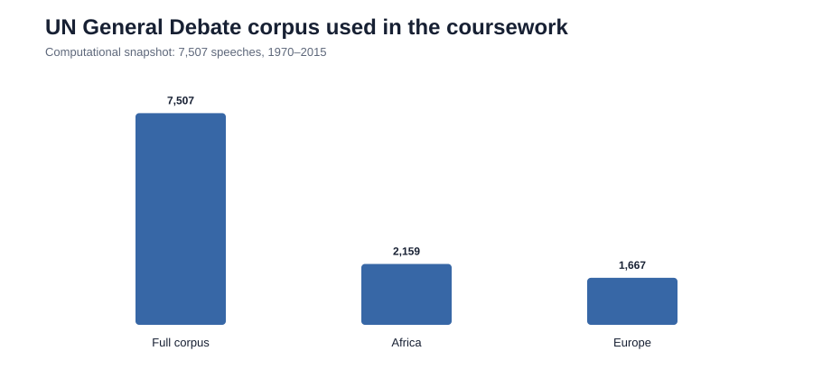
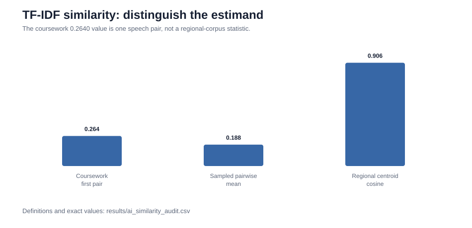
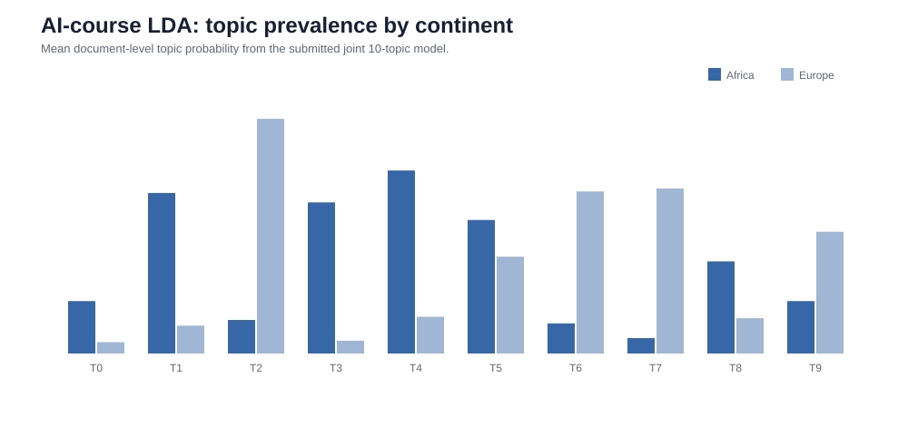
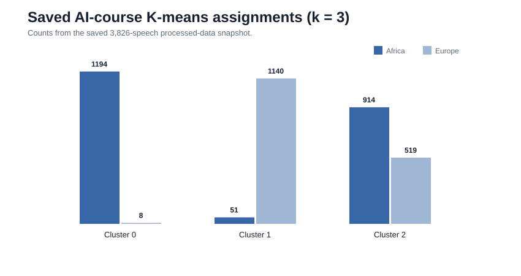
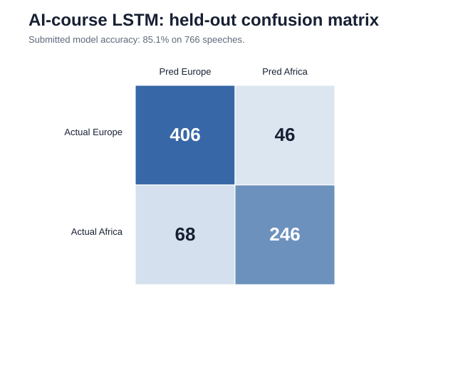
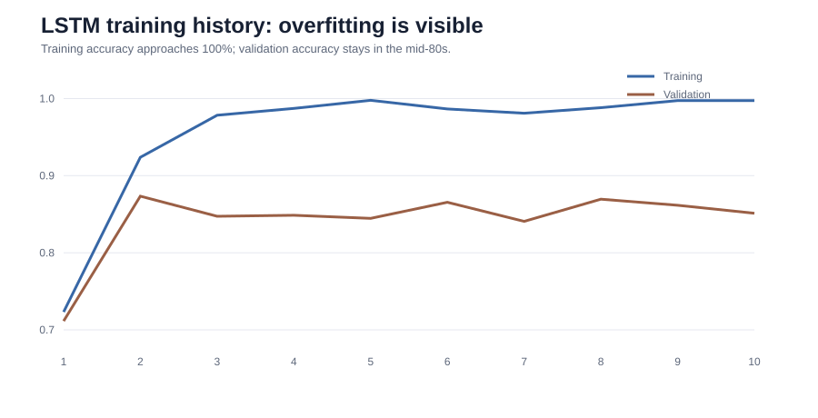
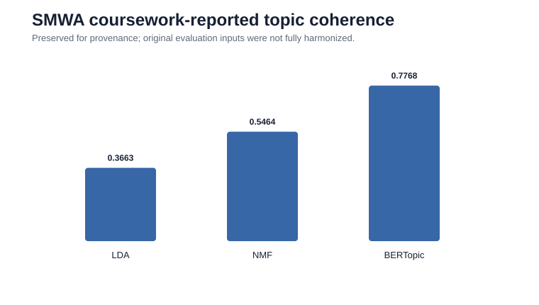
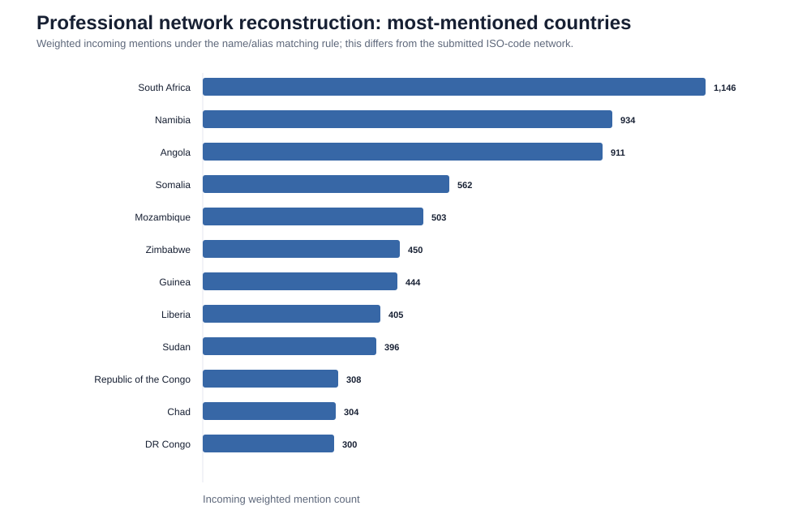

# UN General Debate NLP & Machine Learning

**Africa–Europe comparison with an Africa-focused topic-modeling and network-analysis extension**

A reproducible NLP and machine-learning portfolio project built from two master's coursework submissions using the **United Nations General Debate Corpus (UNGDC)**. The work develops in two connected stages:

1. **AI course foundation — Africa vs Europe:** EDA, regional word clouds, TF-IDF similarity, LDA, K-means, LSTM continent classification, VADER sentiment and sentiment-specific word clouds.
2. **Social Media & Web Analytics extension — Africa:** deeper EDA, Africa sentiment evolution, LDA/NMF/BERTopic, topic-coherence diagnostics, ten NMF topic word clouds and a country-mention network.

> **Provenance rule:** values and plots labeled *coursework-reported/source* reproduce the final coursework artifacts preserved in Google Drive. Professional reconstructions and methodological corrections are labeled separately rather than silently replacing the original analysis.

**Detailed guide:** [`docs/models_and_interpretation.md`](docs/models_and_interpretation.md) explains every model, implementation choice, result and interpretation.  
**Complete source-figure inventory:** [`coursework/FIGURE_INDEX.md`](coursework/FIGURE_INDEX.md) accounts for **22 AI-course source plots + 21 SMWA source plots**.

---

## Research questions

**Part I — Africa vs Europe**  
How similar are African and European UN General Debate statements, which themes distinguish them, and how much regional information can text models recover?

**Part II — Africa extension**  
What themes, sentiment patterns and country-to-country mention relationships characterize African participation in the UN General Debate?

---

## Data at a glance

<p align="center">
  
</p>

| Sample | Speeches |
|---|---:|
| Full computational UNGD corpus | **7,507** |
| Africa | **2,159** |
| Europe | **1,667** |
| Africa + Europe saved AI snapshot | **3,826** |
| Computational coverage | **1970–2015** |

One submitted AI document describes the source as extending through 2016, while the final computational snapshot contains 1970–2015. The discrepancy is documented rather than silently reconciled.

---

# Complete visual results

The most important change in this revision is that the **original word clouds and sentiment figures are visible directly from the repository** rather than being buried in the coursework PDF/archive.

## AI course — Africa vs Europe

### EDA + overall Africa/Europe word clouds

[](coursework/ai_course/figures/figure-sheet-01.jpg)

This sheet contains the original regional corpus diagnostics and the **Africa and Europe overall word clouds**. Both regions are dominated by common UN/international-relations language, but Africa places relatively more visual emphasis on development, Africa/South Africa and related regional language, while Europe gives more prominence to human-rights and European/Cold-War/geopolitical vocabulary.

### TF-IDF + LDA regional topic comparison

[](coursework/ai_course/figures/figure-sheet-02.jpg)

The joint 10-topic LDA model reveals strong regional differences in topic prevalence: colonial/apartheid and African conflict/development topics are Africa-heavy; Kosovo/terrorism, Soviet/Cold-War and Balkan topics are Europe-heavy.

### K-means diagnostics and clusters

[](coursework/ai_course/figures/figure-sheet-03.jpg)

The elbow diagnostic motivates **k = 3**. African speeches dominate one development/security-heavy cluster, European speeches dominate a governance/rights-heavy cluster, and both regions appear substantially in a mixed economic/international-relations cluster.

### LSTM + sentiment distribution and sentiment trend

[](coursework/ai_course/figures/figure-sheet-04.jpg)

This sheet contains the **LSTM evaluation together with the Africa-Europe VADER sentiment distribution and sentiment-over-time plots**. The coursework reports **85.1% LSTM test accuracy**. The sentiment curves fluctuate substantially; the submitted interpretation emphasizes more negative African sentiment in parts of the 1970s through the mid-1980s followed by improvement and continued variation.

### Positive/negative sentiment word clouds — Africa and Europe

[](coursework/ai_course/figures/figure-sheet-05.jpg)

These are the original four **sentiment-specific word clouds**:

| Region / polarity | Most visible source vocabulary | Interpretation |
|---|---|---|
| Africa — positive | United Nations, peace, security, justice, freedom, hope, progress, support, respect | cooperation, institutional aspiration and peace/security |
| Africa — negative | world war, conflict, terrorism, violence, poverty, destruction, crisis, weapon | conflict, insecurity and hardship |
| Europe — positive | United Nations, freedom, peace, security, respect, support, cooperation, justice | institutional cooperation, rights and peace |
| Europe — negative | war, terrorism, violence, weapon, conflict, mass destruction, crisis, human rights | conflict/security threats and rights violations |

**Full AI visual gallery and interpretation:** [`coursework/ai_course/figures.md`](coursework/ai_course/figures.md)

---

## Social Media & Web Analytics — Africa extension

[](coursework/social_media_web_analytics/figures/figure-sheet-01.jpg)

The submitted-paper sheet contains Africa EDA, the **overall Africa word cloud**, positive/negative sentiment word clouds, sentiment trend and the country-mention network.

The second Drive audit found that the final SMWA source `Graphs` folder is richer than the PDF: it contains **21 individual analytical PNGs**, including `sentiment_distribution.png`, `LDA_topic_distribution.png`, `topic_distribution_heatmap.png`, **ten NMF topic word clouds (`topic_0.png`–`topic_9.png`)**, and `network_plot.png`.

**Full SMWA source-graph explanation:** [`coursework/social_media_web_analytics/figures.md`](coursework/social_media_web_analytics/figures.md)  
**Seven-figure submitted-paper archive:** [`coursework/social_media_web_analytics/SMWA_all_figures.pdf`](coursework/social_media_web_analytics/SMWA_all_figures.pdf)

---

# Part I — AI course foundation: Africa vs Europe

## 1. Exploratory text analysis and word clouds

The original workflow maps country codes to continents, filters Africa and Europe, then analyzes participation, speech length and vocabulary after cleaning/tokenization/stop-word removal/lemmatization.

### Interpretation

The regional word clouds demonstrate a **large shared diplomatic vocabulary**. That is expected: all documents are speeches delivered in the same institutional setting. The meaningful comparison is therefore the *relative prominence* of terms rather than whether a word appears at all.

Africa's source cloud prominently includes institutional/development language such as **United Nations, international community, developing country, Security Council, South Africa, peace and development**. Europe's cloud emphasizes similarly institutional language while showing more **human-rights, Soviet/Cold-War, European and geopolitical vocabulary**.

Word clouds are exploratory frequency displays, not estimates of statistical significance or causal priorities.

---

## 2. TF-IDF similarity — measurement correction

**TF-IDF** weights terms by how frequent they are in a document and how distinctive they are across documents. **Cosine similarity** compares weighted text vectors.

A key QA finding is that the source notebook prints `cosine_sim[0][0]`. Therefore the coursework-reported **0.2640 is one Europe-Africa speech-pair similarity**, not the average similarity of the two regional corpora.

<p align="center">
  
</p>

| Similarity estimand | Value | What it measures |
|---|---:|---|
| Original first speech pair | **0.264** | the source `cosine_sim[0][0]` |
| Sampled cross-region pairwise mean | **~0.188** | mean similarity over deterministic 300×300 cross-region speech pairs |
| Regional TF-IDF centroid cosine | **~0.906** | similarity between average regional TF-IDF vectors |

### Interpretation

Individual African and European speeches are often quite different even though both corpora share a strong common UN vocabulary when aggregated. The three values are therefore not contradictory; they answer different measurement questions.

Exact definitions are stored in [`results/ai_similarity_audit.csv`](results/ai_similarity_audit.csv).

---

## 3. Joint LDA topic model

**LDA (Latent Dirichlet Allocation)** is a probabilistic mixed-membership model: every speech can contain multiple topics, and every topic is represented by a probability distribution over words.

The AI coursework estimates **10 topics** with `no_above=0.30`, `no_below=10`, **50 passes** and `random_state=0`, then compares mean topic prevalence by continent.

<p align="center">
  
</p>

| Topic | Leading terms | Africa | Europe | Interpretation |
|---|---|---:|---:|---|
| 0 | Sudan, Morocco, Egypt, Mediterranean, Libya | 0.0578 | 0.0125 | North Africa / Mediterranean geopolitics |
| 1 | racist, aggression, colonial, peoples, Zimbabwe | **0.1771** | 0.0307 | colonialism, racism, apartheid-era politics |
| 2 | Kosovo, terrorist, prevention, Spain, Iraq | 0.0370 | **0.2589** | Kosovo, terrorism and security/legal issues |
| 3 | Somalia, Liberia, Sierra Leone, Congo | **0.1667** | 0.0141 | African regional conflict/governance |
| 4 | Chad, Rwanda, Burundi, Niger | **0.2019** | 0.0405 | African conflict/recovery |
| 5 | Ireland, Africa, Ethiopia, Cyprus, sanction | 0.1473 | 0.1068 | mixed geopolitics/sanctions |
| 6 | Soviet, détente, socialist, German | 0.0332 | **0.1788** | Cold-War/European politics |
| 7 | Bosnia, Herzegovina, Yugoslavia, Cyprus | 0.0170 | **0.1820** | Balkan/European conflict and transition |
| 8 | food, goals, health, Malawi, Guinea | **0.1016** | 0.0389 | development, health, food and MDGs |
| 9 | France, culture, Italy, religion | 0.0578 | **0.1343** | European/cultural-political vocabulary |

### Interpretation

The strongest contrasts are substantive rather than merely lexical: African statements devote more modeled mass to colonial/apartheid history, regional conflict and development/health; European statements devote more to Kosovo/Balkan politics, terrorism and Cold-War/European themes. Topic labels remain interpretations of high-weight terms, not ground truth or causal effects.

Exact topic words/prevalence: [`results/ai_lda_topics_and_prevalence.csv`](results/ai_lda_topics_and_prevalence.csv).

---

## 4. K-means clustering

**K-means** performs hard clustering of TF-IDF speech vectors: every speech is assigned to one cluster rather than receiving a topic mixture.

The source elbow diagnostic motivates **three clusters**.

<p align="center">
  
</p>

| Continent | Cluster 0 | Cluster 1 | Cluster 2 |
|---|---:|---:|---:|
| Africa | **1,194** | 51 | **914** |
| Europe | 8 | **1,140** | **519** |

Source top terms suggest:

- **Cluster 0:** development / peace / security / Africa;
- **Cluster 1:** international governance / security / human-rights language;
- **Cluster 2:** economic / international-relations vocabulary.

### Interpretation

Regional sorting is strong, especially in Clusters 0 and 1, but all clusters retain generic UN terms. They should therefore be read as **different thematic mixtures inside a common diplomatic vocabulary**, not clean ideological camps.

The submitted PDF contains slightly different counts from another source run; the GitHub chart uses the audited saved-data snapshot and preserves the discrepancy in the QA documentation.

---

## 5. LSTM continent classification

An **LSTM (Long Short-Term Memory)** network is a sequence model. Here it uses word order/patterns to predict whether a speech belongs to Africa or Europe.

Source architecture:

- 80/20 train-test split (`random_state=42`);
- 10,000-word tokenizer vocabulary;
- sequence length 100;
- 100-dimensional embedding;
- LSTM(128);
- Adam learning rate 0.001;
- batch size 20;
- 10 epochs.

**Coursework-reported held-out accuracy: 85.1%** on 766 speeches.

<p align="center">
  
</p>

| Class | Precision | Recall | F1 | Support |
|---|---:|---:|---:|---:|
| Europe | 0.86 | 0.90 | 0.88 | 452 |
| Africa | 0.84 | 0.78 | 0.81 | 314 |

<p align="center">
  
</p>

### Interpretation

The classifier confirms that regional information is recoverable from language: most held-out statements are classified correctly. African recall is lower (0.78), indicating more African-to-European misclassification in the test set.

Training accuracy approaches 100% while validation accuracy remains in the mid-80s, indicating **overfitting**. The source notebook also used the held-out test set as validation data during training; the professional helper corrects this by deriving validation data from training and reserving the test set for final evaluation.

Predictive separability does not mean either continent has homogeneous political preferences.

---

## 6. VADER sentiment — Africa vs Europe

**VADER** is a rule-based lexicon sentiment method that produces negative, neutral, positive and compound scores. It is a measurement tool, not a learned model of UN diplomacy.

The coursework includes:

- Africa-Europe sentiment distributions;
- annual mean sentiment trends;
- positive Africa word cloud;
- negative Africa word cloud;
- positive Europe word cloud;
- negative Europe word cloud.

The original plots are shown above in **AI figure sheets 4–5**.

### Interpretation

Across both regions, positive passages emphasize **peace, security, justice, freedom, cooperation, support and institutional language**. Negative passages emphasize **war, terrorism, violence, conflict, weapons, destruction, poverty and crisis**. This indicates a substantial shared diplomatic sentiment vocabulary, with changing historical prevalence.

### Measurement caveat

The source coursework contains more than one sentiment implementation. One path works on preprocessed text, while the word-cloud path returns to original speech sentences. The professional implementation in [`src/sentiment.py`](src/sentiment.py) therefore scores sentence-like units from **original speech text** before aggregating to the speech level. Original plots remain source evidence and are not relabeled as newly validated estimates.

---

# Part II — Social Media & Web Analytics extension: Africa

## 7. Africa corpus diagnostics and overall word cloud

The extension narrows the analysis to **2,159 African statements**. The submitted source reports a right-skewed statement-length distribution, fairly consistent session participation, and an Africa word cloud dominated by **United Nations, international community, developing country and Security Council** vocabulary.

### Interpretation

The corpus is institutionally coherent but substantively heterogeneous. Frequent institutional terms establish the background language against which the topic models identify more specific conflict, development, health, rights and regional-geopolitical themes.

---

## 8. Africa sentiment over time

The source analysis reports substantial year-to-year fluctuation together with a **gradual upward trend in positivity over 1970–2015**.

Source word-cloud vocabulary:

- **positive:** United Nations, peace, organization, people, security, justice, freedom, development, hope, respect;
- **negative:** war, terrorism, conflict, violence, destruction, poverty, weapon, crisis.

### Interpretation

Positive discourse is centered on multilateral cooperation and aspirations; negative discourse is centered on conflict, security threats and hardship. VADER was not designed specifically for long formal diplomatic speeches, so these scores are best treated as descriptive indicators rather than direct measures of national preferences.

---

## 9. LDA, NMF and BERTopic — what each model adds

The SMWA extension compares three unsupervised topic-modeling approaches.

<p align="center">
  
</p>

| Model | Representation | Topic structure | Coursework `c_v` |
|---|---|---|---:|
| LDA | word counts / bag of words | probabilistic mixed membership | **0.3663** |
| NMF | TF-IDF | additive non-negative factors | **0.5464** |
| BERTopic | transformer embeddings + clustering | contextual semantic clusters | **0.7768** |

### Africa LDA

The largest source LDA topic shares are approximately:

- **30.3%:** racist / colonial / Pretoria / Zimbabwe / colonialism;
- **28.8%:** recovery / Senegal / drought / structural-development language;
- **12.8%:** goals / MDGs / Niger / Côte d'Ivoire-related vocabulary;
- **6–7%:** Congo/Burundi/security and Somalia/Sierra Leone/Liberia conflict themes.

This specification places colonial/apartheid history and development/recovery at the center of the modeled corpus.

### NMF

The final source `Graphs` folder contains a **topic-distribution heatmap plus ten NMF topic word clouds**. Major source-derived factors include:

| NMF topic | Interpretation |
|---|---|
| 0 | apartheid / Namibia / Southern Africa |
| 1 | sustainable development, global goals, MDGs/2015 |
| 2 | Guinea-region governance and human rights |
| 3 | Morocco/Tunisia/Egypt / Arab-Maghreb politics |
| 4 | Swaziland/Eswatini monarchy and diplomacy |
| 5 | Ethiopia/Somalia/Eritrea/Sudan / Horn of Africa |
| 6 | independence, struggle, rights and territory |
| 7 | Malawi / HIV-AIDS / food and development |
| 8 | Chad/Libya/Sudan/Darfur security |
| 9 | Burundi/Rwanda/Congo / Great Lakes conflict |

NMF's source `c_v` is **0.5464**, higher than LDA's reported value. Its factors are often easy to label but several are strongly driven by country names.

### BERTopic

BERTopic uses contextual embeddings and clustering rather than a fixed bag-of-words mixture. The source notebook reports **`c_v = 0.7768`**, the largest of the three coursework values. Source topics include broad institutional/development language as well as narrower clusters around Liberia, Somalia, Angola, Madagascar and climate change.

### Model-comparison interpretation

The submitted paper ranks BERTopic highest on coherence. The professional audit preserves that conclusion but does **not** treat the three numbers as a fully harmonized tournament because the original coherence reference construction differs by model. BERTopic also creates many more/narrower clusters than the fixed 10-topic LDA/NMF specifications.

The most robust substantive conclusion comes from **agreement across models**: conflict/security, development, rights, colonial history, health and regional geopolitics repeatedly appear as major dimensions of African UN General Debate discourse.

---

## 10. Country-mention network

The submitted paper interprets **Madagascar, Namibia, Comoros and Somalia** as prominent nodes, South Sudan as comparatively isolated, and discusses East/West African clusters.

The original code searches speech text for **ISO3 country codes**, a fragile measurement choice because natural-language speeches normally contain names rather than ISO codes. The professional reconstruction therefore matches country names and historical/orthographic aliases.

<p align="center">
  
</p>

### Interpretation

The source network and professional reconstruction intentionally produce different rankings because they use different mention definitions. This demonstrates an important analytical point: **network results depend on how textual relationships are operationalized**.

Mention centrality is descriptive; it is not a causal measure of diplomatic influence, alliance strength or political importance.

---

# Integrated interpretation

Taken together, the two coursework stages provide a coherent empirical story:

1. **Shared institutional language:** African and European speeches both strongly reflect the common vocabulary of UN diplomacy.
2. **Different thematic emphasis:** topic prevalence and clustering separate colonial/apartheid, African-conflict/development themes from Balkan/Cold-War/European-security themes.
3. **Predictive regional signal:** an LSTM can recover continent from text with **85.1% test accuracy**, although the model overfits.
4. **Shared sentiment lexicons:** positive passages emphasize peace/cooperation/rights; negative passages emphasize war/terrorism/violence/conflict.
5. **Method robustness and model dependence:** LDA, NMF and BERTopic repeatedly recover conflict, development, rights, health and regional geopolitics, but their granularity and coherence differ.
6. **Measurement matters:** the cosine scalar, sentiment unit, coherence construction and network mention rule all materially affect conclusions. The professional rebuild makes those choices explicit.

For the long-form explanation of every model and interpretation, read [`docs/models_and_interpretation.md`](docs/models_and_interpretation.md).

---

## Reproducible notebooks

| Notebook | Scope |
|---|---|
| [`01_africa_ungd_nlp.ipynb`](notebooks/01_africa_ungd_nlp.ipynb) | Africa EDA, word cloud, corrected sentiment, LDA, NMF, optional BERTopic |
| [`02_africa_europe_ml.ipynb`](notebooks/02_africa_europe_ml.ipynb) | Africa-Europe EDA, similarity audit, executable LDA, K-means, optional full LSTM, corrected sentiment |
| [`03_africa_network_extension.ipynb`](notebooks/03_africa_network_extension.ipynb) | original-network audit, professional country-name/alias network, centrality and strongest ties |

Reusable modules:

```text
src/
├── preprocessing.py
├── comparative_analysis.py
├── sentiment.py
├── topic_models.py
├── network_analysis.py
└── visualization.py
```

---

## Reproduce the project

```bash
python -m venv .venv
# activate the environment
pip install -r requirements.txt
python scripts/bootstrap_nltk.py
```

Place the public UNGD CSV at:

```text
data/un-general-debates.csv
```

Then run the notebooks in numerical order. Optional heavy components:

```bash
pip install -r requirements-bertopic.txt   # BERTopic
pip install -r requirements-ai.txt         # TensorFlow / LSTM
```

---

## QA and provenance

The professional rebuild includes automated tests, GitHub Actions CI, explicit input validation and separate documentation of source-versus-reconstructed results.

- [`docs/qa.md`](docs/qa.md) — source audit and implementation discrepancies;
- [`docs/methodology.md`](docs/methodology.md) — methodological provenance;
- [`docs/findings.md`](docs/findings.md) — consolidated substantive findings;
- [`docs/models_and_interpretation.md`](docs/models_and_interpretation.md) — detailed model mechanics and interpretation;
- [`coursework/FIGURE_INDEX.md`](coursework/FIGURE_INDEX.md) — all source graph files found in Drive;
- [`figures/professional/README.md`](figures/professional/README.md) — professional-figure provenance.

Large raw/processed datasets are intentionally excluded from Git history; the public UNGD corpus is downloaded locally and derived data are regenerated from code.

---

## Interpretation boundary

This is a **descriptive NLP and machine-learning project**, not a causal analysis. Cosine similarity, topic prevalence, cluster membership, classifier accuracy, sentiment and network centrality are measurements derived from text. They do not identify the causal effect of geography or historical events and should not be interpreted as evidence that either Africa or Europe has a single homogeneous political position.

## Author

**Maha Gasim**  
MSc Data Analytics for Business and Society, Ca' Foscari University of Venice
