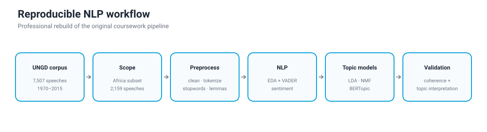
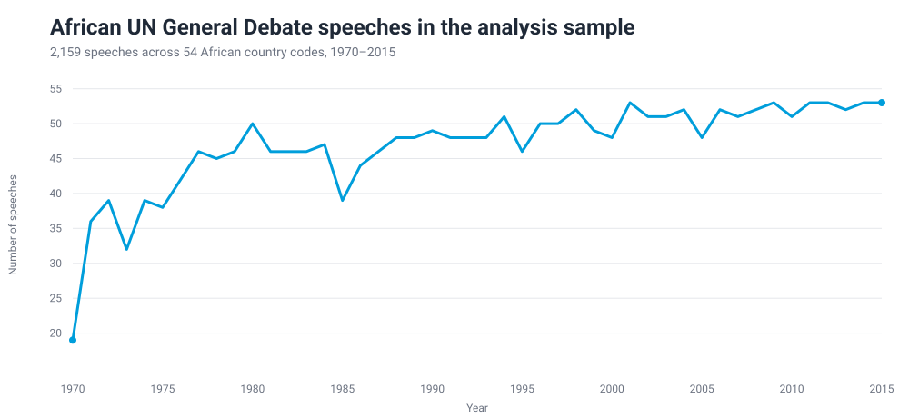
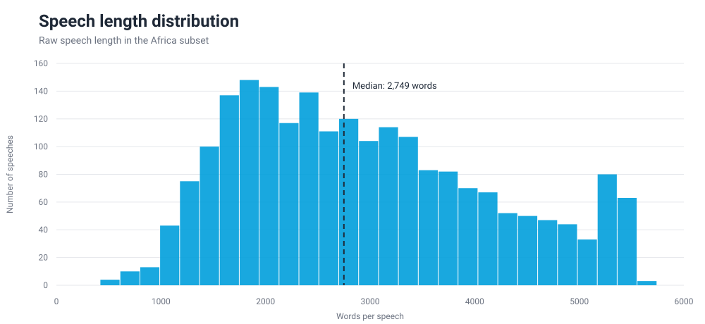
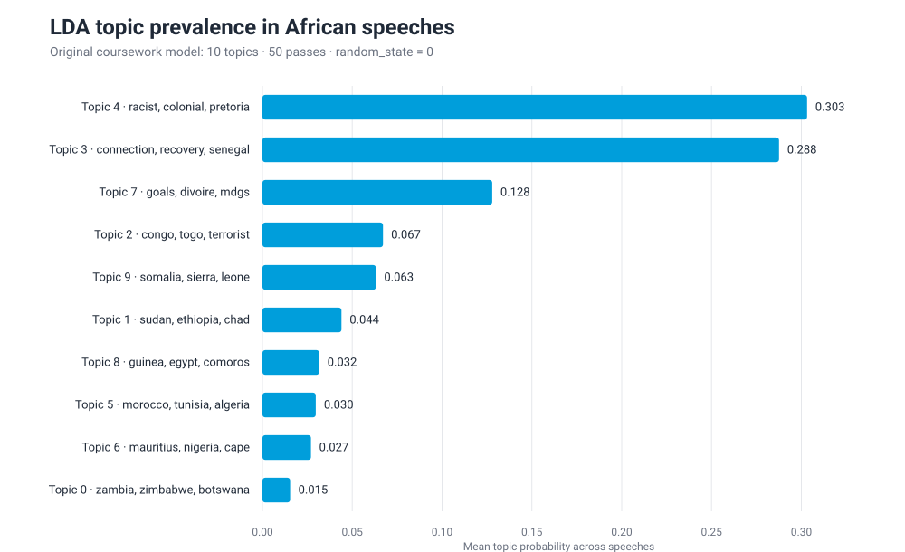

# UN General Debate NLP & Topic Modeling

A reproducible natural-language-processing analysis of **United Nations General Debate (UNGD) speeches**, rebuilt from master's coursework into a research-oriented portfolio project.

<p align="center">
  
</p>

## Research objective

The project asks a descriptive measurement question:

> **What recurring themes structure African countries' UN General Debate statements, and how do classical and embedding-based topic models represent those themes?**

The workflow combines corpus diagnostics, sentiment measurement, and three unsupervised topic-modeling approaches: **Latent Dirichlet Allocation (LDA), Non-negative Matrix Factorization (NMF), and BERTopic**. It is descriptive NLP rather than causal inference.

## At a glance

| Item | Coursework analysis snapshot |
|---|---:|
| Full UNGD corpus | **7,507 speeches** |
| Africa subset | **2,159 speeches** |
| African country codes | **54** |
| Coverage | **1970–2015** |
| Median speech length, Africa | **2,749 words** |
| Topic models | **LDA · NMF · BERTopic** |
| Original Africa LDA `c_v` coherence | **0.3663** |

The figures and observation counts on this page are grounded in the final coursework notebook and its processed Africa dataset. A separate coursework report used a different corpus snapshot; the reconciliation is documented in [`docs/methodology.md`](docs/methodology.md).

## Data

The corpus contains country-level General Debate statements with the core fields `country`, `session`, `year`, and `text`. The raw file is intentionally **not committed** because it is large; the repository rebuilds transformations from the public source instead of versioning duplicated data files.

See [`data/README.md`](data/README.md) for the expected local file and source information.

## Corpus diagnostics

<p align="center">
  
</p>

The available Africa sample expands substantially over the period. This pattern should not be interpreted mechanically as a behavioral change in diplomatic participation: UN membership and corpus coverage also change over time.

<p align="center">
  
</p>

Speech length is heterogeneous, with a median of **2,749 words** in the processed Africa sample. This matters computationally because long diplomatic statements can dominate vocabulary counts and make preprocessing decisions consequential.

## Topic modeling

### LDA

The original Africa analysis estimated a **10-topic Gensim LDA model** with vocabulary filtering, **50 passes**, and `random_state=0`. Its recorded `c_v` coherence was **0.3663**.

<p align="center">
  
</p>

The figure reports mean document-level topic probability from the original run and shows the leading words rather than imposing ex-post substantive labels. In that model, Topics 4 and 3 carry the largest average prevalence, while Topic 7 contains terms such as `goals`, `mdgs`, and `governance`. Substantive topic labels should be assigned only after inspecting representative speeches.

### NMF

NMF is estimated on a **TF-IDF document-term matrix** with 10 components. The rebuild separates vectorization, estimation, topic-word extraction, and coherence calculation so the procedure is transparent and reusable.

### BERTopic

BERTopic provides an embedding-based comparison to the bag-of-words models. Because it has a heavier dependency stack, it is imported lazily and is **optional by default** in the clean notebook. The rebuild evaluates extracted topic words against a common tokenized reference corpus rather than treating incomparable coherence calculations as a model ranking.

## Sentiment analysis

The original coursework included VADER sentiment analysis. During the rebuild, I identified that sentence tokenization had been applied after speeches were reduced to individual tokens, so the original sentiment figure is **not presented as a validated result** here. [`src/sentiment.py`](src/sentiment.py) corrects the unit of analysis by scoring sentence-like units from the original speech text and aggregating them to the speech level.

This is an example of the purpose of the rebuild: preserve the analytical idea while making the implementation methodologically defensible.

## Reproducible project structure

```text
.
├── data/
│   └── README.md
├── docs/
│   └── methodology.md
├── figures/
│   ├── africa_speeches_over_time.svg
│   ├── lda_topic_prevalence.svg
│   ├── speech_length_distribution.svg
│   └── workflow.svg
├── notebooks/
│   └── 01_africa_ungd_nlp.ipynb
├── src/
│   ├── preprocessing.py
│   ├── sentiment.py
│   ├── topic_models.py
│   └── visualization.py
├── .gitignore
├── requirements.txt
└── README.md
```

## Reproduce the analysis

```bash
python -m venv .venv
pip install -r requirements.txt
python -m nltk.downloader punkt stopwords wordnet
```

Then place the public UNGD CSV at:

```text
data/un-general-debates.csv
```

and run [`notebooks/01_africa_ungd_nlp.ipynb`](notebooks/01_africa_ungd_nlp.ipynb).

## What the professional rebuild improves

- removes Colab-specific installation cells and absolute Google Drive paths;
- constructs the Africa sample without chained-assignment side effects;
- separates preprocessing, sentiment, modeling, and plotting into reusable modules;
- corrects the sentiment unit of analysis;
- makes coherence evaluation more comparable across topic models;
- keeps BERTopic optional so classical models remain lightweight;
- excludes large raw/processed datasets from Git history;
- separates network analysis into its own project rather than mixing two analytical workflows;
- documents discrepancies between coursework artifacts instead of silently reconciling them.

For the full methodological audit, see [`docs/methodology.md`](docs/methodology.md).

## Author

**Maha Gasim**  
MSc Data Analytics for Business and Society, Ca' Foscari University of Venice
