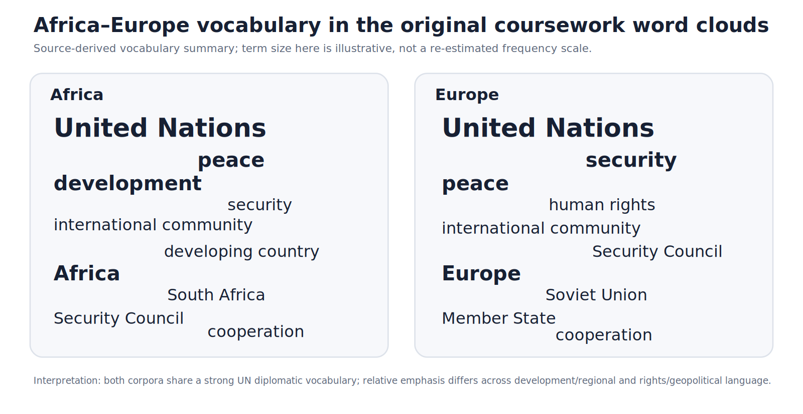
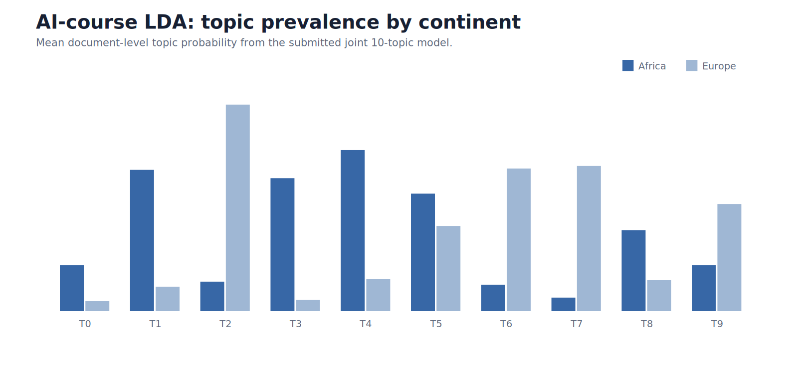
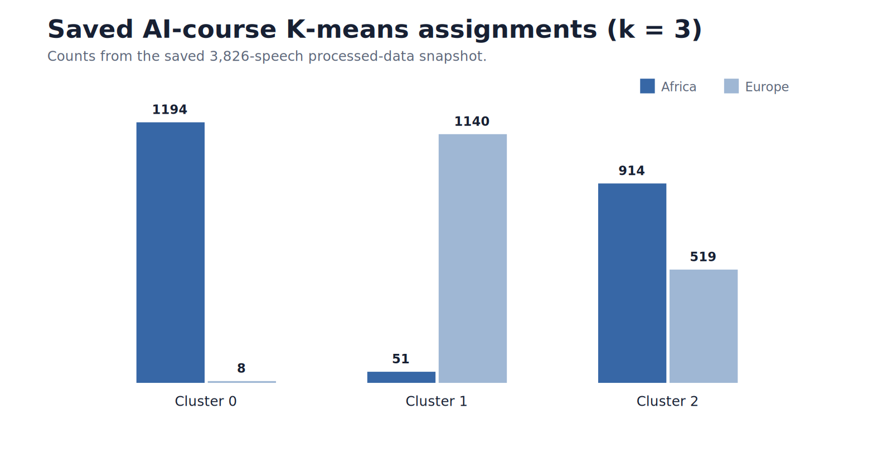
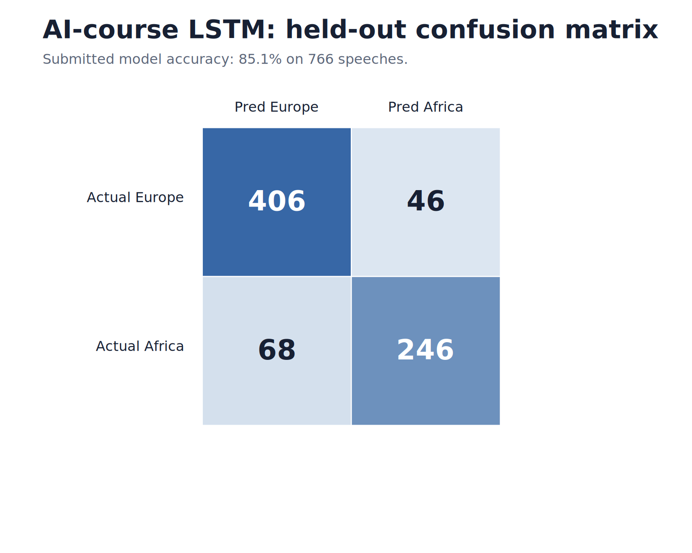
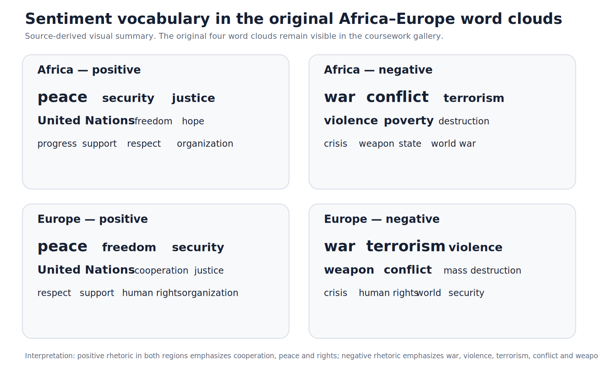

# AI course — complete Africa-Europe visual gallery

This page makes the **original AI-course analytical outputs visible directly in GitHub** rather than requiring a reader to hunt through the submitted PDF. The source audit found **22 individual analytical files** in the final Africa-Europe `Graphs` folder; the original outputs are collected below in five archival JPEG sheets that render reliably in GitHub Markdown.

For the filename-level source inventory, see [`../FIGURE_INDEX.md`](../FIGURE_INDEX.md). For model mechanics and detailed interpretation, see [`../../docs/models_and_interpretation.md`](../../docs/models_and_interpretation.md).

---

## 1. Corpus diagnostics and regional word clouds

**Open at full resolution:** [`figure-sheet-01.jpg`](../../figures/rendered/ai_regional_vocabulary_summary.png)

This sheet covers the Africa/Europe session distributions, country participation, speech-length diagnostics and the two **overall regional word clouds**.

### Interpretation

Both regions share the institutional vocabulary of UN diplomacy. The Africa cloud gives substantial visual prominence to **United Nations, international community, developing countries, Africa/South Africa, peace, security and development**. The Europe cloud similarly emphasizes **United Nations, international community, human rights, Security Council, peace/security and European/Cold-War-related vocabulary**.

The key comparison is relative prominence rather than mere word presence. Word clouds are exploratory frequency displays, not formal tests of regional priorities.

---

## 2. TF-IDF similarity and LDA topic comparison

**Open at full resolution:** [`figure-sheet-02.jpg`](../../figures/rendered/ai_lda_topic_prevalence.png)

The source notebook computes TF-IDF representations and a Europe×Africa cosine-similarity matrix. A QA finding is that the submitted **0.2640** scalar is `cosine_sim[0][0]` — one Europe–Africa speech pair, not a regional-corpus average. The professional audit therefore separates it from the sampled pairwise mean (~0.188) and regional centroid cosine (~0.906).

The joint **10-topic LDA** model reveals strong regional contrasts:

- Africa-heavy themes: **colonialism/racism**, Somalia-Liberia-Sierra Leone-Congo, Chad-Rwanda-Burundi, development/health/MDGs;
- Europe-heavy themes: **Kosovo/terrorism**, Soviet/détente language, Bosnia-Herzegovina/Yugoslavia/Cyprus.

Full topic terms and prevalence values are stored in [`../../results/ai_lda_topics_and_prevalence.csv`](../../results/ai_lda_topics_and_prevalence.csv).

---

## 3. K-means diagnostics and cluster structure

**Open at full resolution:** [`figure-sheet-03.jpg`](../../figures/rendered/ai_kmeans_by_continent.png)

The elbow diagnostic motivates **three clusters**. In the audited saved-data snapshot:

| Continent | Cluster 0 | Cluster 1 | Cluster 2 |
|---|---:|---:|---:|
| Africa | **1,194** | 51 | **914** |
| Europe | 8 | **1,140** | **519** |

Source top terms suggest a development/security-heavy cluster, a governance/rights-heavy cluster, and a mixed economic/international-relations cluster. Because generic UN terms appear throughout, the clusters should not be interpreted as clean ideological blocs.

---

## 4. LSTM classification and sentiment distribution/trends

**Open at full resolution:** [`figure-sheet-04.jpg`](../../figures/rendered/ai_lstm_confusion_matrix.png)

This sheet includes the LSTM evaluation and the **Africa-Europe VADER sentiment distribution and sentiment-over-time graphs**.

### LSTM result

The coursework reports **85.1% held-out accuracy**. Europe has precision/recall/F1 of **0.86/0.90/0.88** and Africa **0.84/0.78/0.81**. The training history indicates overfitting because training accuracy approaches 100% while validation accuracy remains around the mid-80s.

### Sentiment result

The source sentiment comparison shows both regional series fluctuating over 1970–2015. The submitted interpretation emphasizes relatively more negative African sentiment in parts of the **1970s through the mid-1980s**, followed by improvement and continued variation.

The professional QA retains the original plot while documenting the unit-of-analysis problem found in one source sentiment path.

---

## 5. Positive and negative sentiment word clouds

**Open at full resolution:** [`figure-sheet-05.jpg`](../../figures/rendered/ai_sentiment_vocabulary_summary.png)

This sheet contains the four original **sentiment-specific word clouds**.

| Region / polarity | Prominent source vocabulary | Interpretation |
|---|---|---|
| Africa — positive | United Nations, peace, security, justice, freedom, hope, progress, support, respect | cooperation, institutional aspiration and peace/security |
| Africa — negative | world war, conflict, terrorism, violence, poverty, destruction, crisis, weapon | conflict, insecurity and hardship |
| Europe — positive | United Nations, freedom, peace, security, respect, support, cooperation, justice | institutional cooperation, rights and peace |
| Europe — negative | war, terrorism, violence, weapon, conflict, mass destruction, crisis, human rights | conflict/security threats and rights violations |

The common pattern is clear: positive passages emphasize **peace, cooperation, rights and institutional support**, while negative passages emphasize **war, violence, terrorism, conflict and weapons**.

---

## Complete AI-course source accounting

The final Drive `Graphs` folder contains **22 analytical source files**:

- 8 EDA/regional-vocabulary plots;
- 1 LDA comparison plot;
- 6 K-means diagnostics/cluster plots;
- 1 LSTM confusion matrix;
- 2 sentiment distribution/trend plots;
- 4 positive/negative sentiment word clouds.

Every source filename is listed in [`../FIGURE_INDEX.md`](../FIGURE_INDEX.md).

The professional reconstruction is organized in [`../../notebooks/02_africa_europe_ml.ipynb`](../../notebooks/02_africa_europe_ml.ipynb), with reusable code in [`../../src/comparative_analysis.py`](../../src/comparative_analysis.py), [`../../src/sentiment.py`](../../src/sentiment.py) and [`../../src/visualization.py`](../../src/visualization.py).
