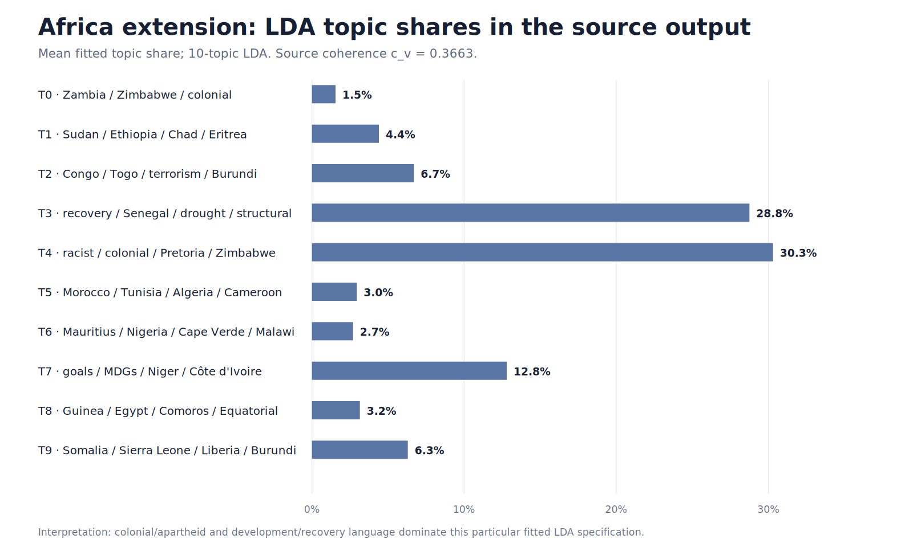
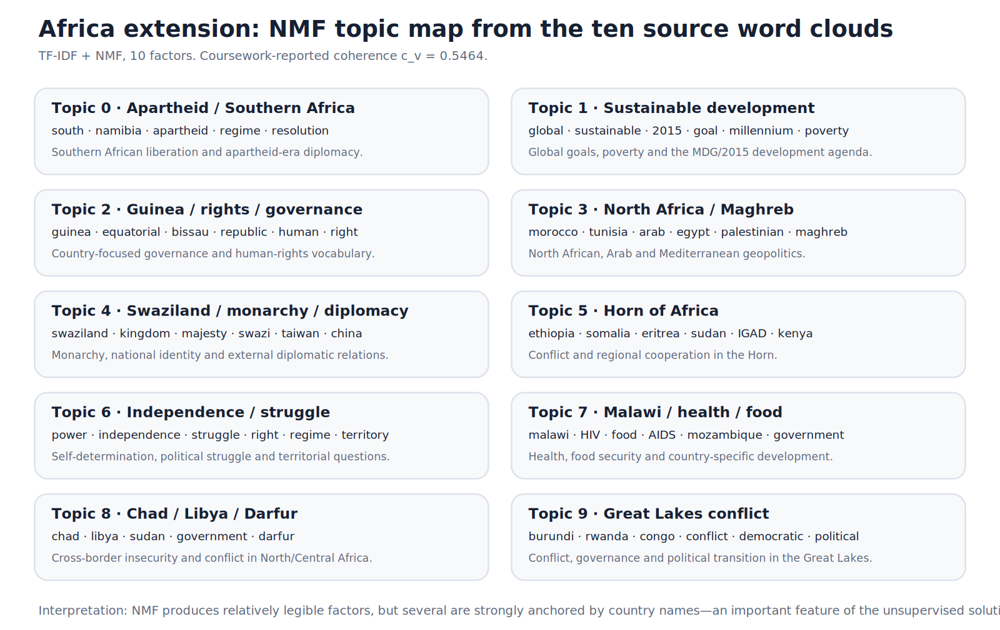
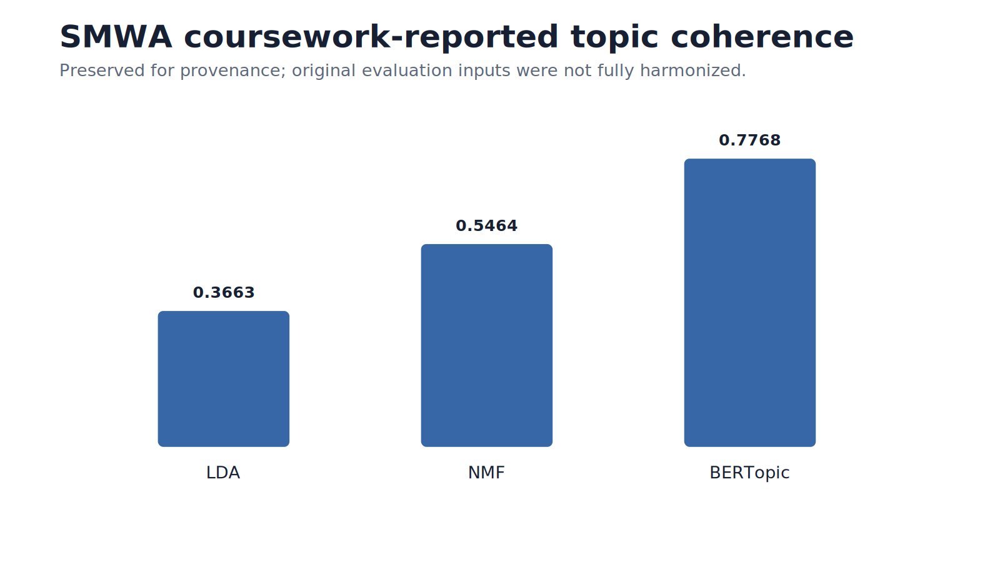
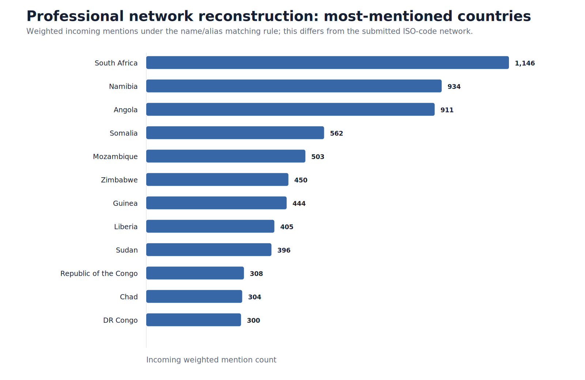

# Social Media & Web Analytics — Africa visual analysis

This gallery documents the **Africa-focused SMWA extension**. The final source `Graphs` folder contains **21 analytical image files**, while BERTopic is stored in notebook topic outputs rather than a separate static plot. The live figures below are validated PNG renderings generated from clean repository sources so they display consistently on GitHub.

For every original filename, see [`../FIGURE_INDEX.md`](../FIGURE_INDEX.md). For model mechanics and methodological qualifications, see [`../../docs/models_and_interpretation.md`](../../docs/models_and_interpretation.md) and [`../../docs/qa.md`](../../docs/qa.md).

---

## 1. Africa vocabulary and sentiment source outputs

The source coursework contains:

- an overall Africa word cloud;
- a VADER sentiment distribution;
- average compound sentiment over time;
- positive-sentiment and negative-sentiment Africa word clouds.

The overall vocabulary is dominated by institutional and development-oriented language including **United Nations, international community, developing country, Security Council, peace, development and cooperation**.

The submitted sentiment analysis reports substantial annual variation with a broadly more positive trajectory over parts of 1970–2015. Positive passages emphasize **peace, organization, security, justice, freedom, development, hope and respect**; negative passages emphasize **war, terrorism, conflict, violence, destruction, poverty, weapons and crisis**.

**Interpretation.** Word clouds are exploratory frequency summaries, while VADER is a rule-based lexicon score. Neither should be treated as a direct measure of ideology, welfare or government preferences. The professional sentiment code also corrects a source unit-of-analysis issue by scoring sentence-like units from raw speech text before aggregation.

---

## 2. LDA topic distribution

The executed notebook reports **LDA `c_v` coherence = 0.3663**. The largest fitted topic shares include:

| Topic | Source terms / interpretation | Mean share |
|---|---|---:|
| Topic 4 | racist, colonial, Pretoria, Zimbabwe, colonialism | **~30.3%** |
| Topic 3 | connection, recovery, Senegal, drought, structural | **~28.8%** |
| Topic 7 | goals, MDGs, Niger, Côte d'Ivoire-related language | **~12.8%** |
| Topic 2 | Congo, Togo, terrorism, Burundi, Guinea-Bissau | **~6.7%** |
| Topic 9 | Somalia, Sierra Leone, Liberia, Burundi | **~6.3%** |

Under this specification, colonial/apartheid discourse and development/recovery language account for a large part of the fitted topic mass, with conflict, MDGs and region/country-specific themes contributing additional components.

Full source output: [`../../results/smwa_lda_topics.csv`](../../results/smwa_lda_topics.csv).

---

## 3. NMF topic structure

The executed notebook reports **NMF `c_v` coherence = 0.5464**. Its ten factors are relatively interpretable:

| NMF topic | Dominant terms | Interpretation |
|---|---|---|
| 0 | south, namibia, apartheid, regime, resolution | apartheid / Southern Africa |
| 1 | global, sustainable, 2015, goal, millennium, poverty | sustainable development / MDGs–SDG transition |
| 2 | guinea, equatorial, bissau, republic, human, right | Guinea-region governance and rights |
| 3 | morocco, tunisia, arab, egypt, palestinian, maghreb | North Africa / Arab-Maghreb politics |
| 4 | swaziland, kingdom, majesty, swazi, taiwan, china | Swaziland/Eswatini monarchy and diplomacy |
| 5 | ethiopia, somalia, eritrea, sudan, IGAD, kenya | Horn of Africa conflict/regional cooperation |
| 6 | power, independence, struggle, right, regime, territory | independence and political struggle |
| 7 | malawi, HIV, food, AIDS, Mozambique | health, food and Malawi development |
| 8 | chad, libya, sudan, darfur | Chad-Libya-Sudan / Darfur security |
| 9 | burundi, rwanda, congo, conflict, democratic | Great Lakes conflict and governance |

The source folder also contains an NMF document-topic heatmap and **ten topic-specific word clouds (`topic_0.png`–`topic_9.png`)**. Country names are often dominant, which helps expose geographically concentrated discourse but also means the model may separate documents partly by country-specific vocabulary rather than abstract policy concepts alone.

Full source output: [`../../results/smwa_nmf_topics.csv`](../../results/smwa_nmf_topics.csv).

---

## 4. LDA, NMF and BERTopic comparison

| Model | Representation | Coursework `c_v` | Main contribution |
|---|---|---:|---|
| LDA | probabilistic bag-of-words | **0.3663** | broad mixed topic prevalence |
| NMF | TF-IDF matrix factorization | **0.5464** | interpretable additive term factors |
| BERTopic | transformer embeddings + clustering | **0.7768** | finer contextual and country-specific clusters |

The executed notebook contains **53 BERTopic topics (0–52)**, ranging from broad institutional/development language to narrower country-specific clusters involving Liberia, Somalia, Angola, Madagascar and others, including climate-change language.

The higher BERTopic coherence is retained as a **coursework-reported diagnostic**, not conclusive proof of model superiority: the three model sections do not build their coherence reference corpora identically, and BERTopic generates many more/narrower topics.

All BERTopic topic words: [`../../results/smwa_bertopic_topics.csv`](../../results/smwa_bertopic_topics.csv).

---

## 5. Country-mention network

The submitted paper highlights **Madagascar, Namibia, Comoros and Somalia**, with South Sudan comparatively isolated and regional East/West African groupings discussed.

A methodological audit found that the original network code searches speech text for ISO3 country codes. The professional reconstruction instead searches country names and historical/orthographic aliases, counting a target at most once per speech. The reconstructed result is therefore intentionally **not expected to reproduce the original ranking exactly**.

The network is descriptive. Mention strength is not causal diplomatic influence, affinity or formal alliance strength.

Professional result table: [`../../results/professional_network_top_mentions.csv`](../../results/professional_network_top_mentions.csv).

---

## Complete SMWA source accounting

The final SMWA `Graphs` folder contains **21 analytical source images**:

- 4 EDA/overall-vocabulary plots;
- 4 sentiment plots/word clouds;
- 1 LDA distribution plot;
- 1 NMF topic-distribution heatmap;
- 10 NMF topic word clouds;
- 1 country-mention network plot.

BERTopic is represented through notebook topic-word outputs rather than an additional static image. The historical source files are retained as provenance; this live gallery uses validated PNG summaries so the portfolio remains readable and dependable in GitHub.

The professional reconstruction is organized in [`../../notebooks/01_africa_ungd_nlp.ipynb`](../../notebooks/01_africa_ungd_nlp.ipynb), [`../../notebooks/03_africa_network_extension.ipynb`](../../notebooks/03_africa_network_extension.ipynb), and the reusable modules under [`../../src/`](../../src/).
