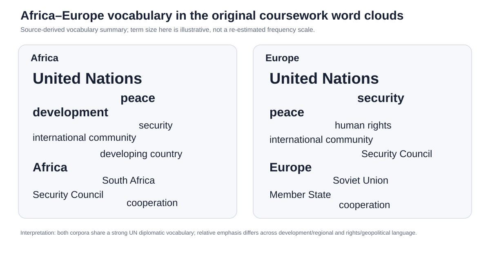
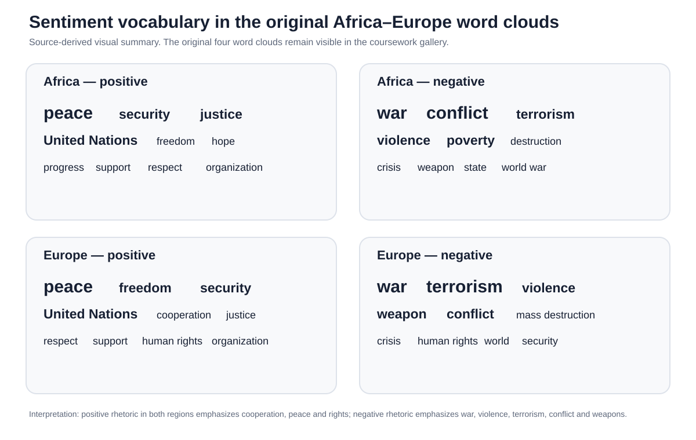
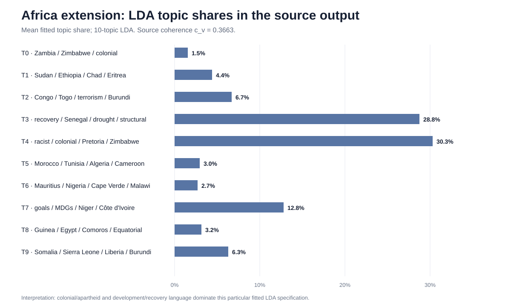
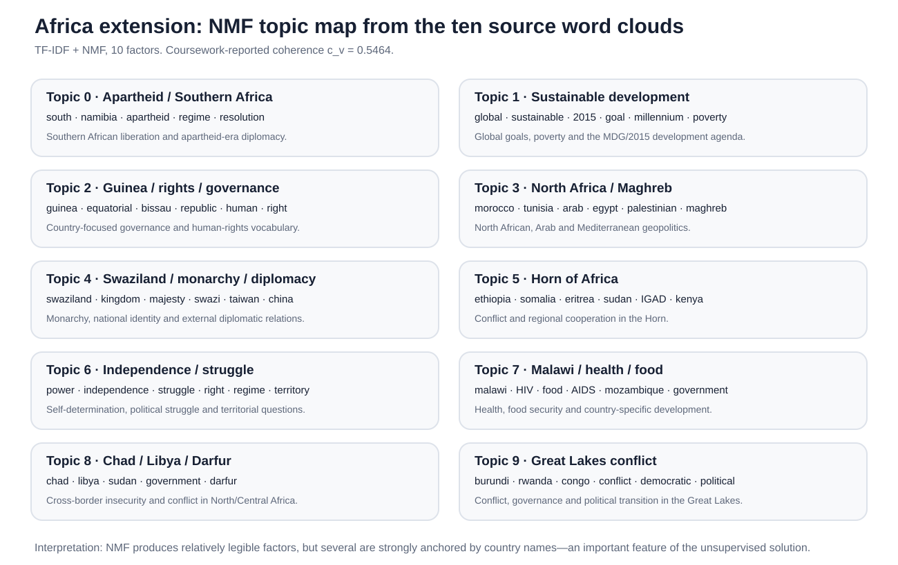

# Professional result figures

These SVGs are the portfolio-facing visuals produced during the QA/publication passes. They are deliberately separated from the **original coursework figures** under `coursework/`.

| Figure | What it shows | Provenance |
|---|---|---|
| `sample_composition.svg` | Full corpus, Africa and Europe sample sizes | Audited computational snapshots |
| `ai_regional_vocabulary_summary.svg` | Key vocabulary visible in the original Africa/Europe word clouds | Source-derived visual summary; not a frequency-scaled replacement |
| `ai_similarity_diagnostics.svg` | First-pair vs sampled-pairwise vs regional-centroid TF-IDF cosine | Saved AI processed snapshot |
| `ai_lda_topic_prevalence.svg` | Joint LDA mean topic probabilities by continent | Submitted AI model outputs |
| `ai_kmeans_by_continent.svg` | Three-cluster assignments by continent | Saved AI processed snapshot |
| `ai_lstm_confusion_matrix.svg` | Held-out confusion matrix | Submitted AI notebook |
| `ai_lstm_training_history.svg` | Training vs validation accuracy over 10 epochs | Submitted AI notebook |
| `ai_sentiment_vocabulary_summary.svg` | Key terms in the four original sentiment word clouds | Source-derived visual summary; original clouds remain in coursework gallery |
| `smwa_lda_topic_shares.svg` | Mean source LDA topic shares for the Africa extension | Executed SMWA source output |
| `smwa_nmf_topic_map.svg` | Ten NMF topics, leading terms and interpretation | Executed SMWA source output + source word clouds |
| `smwa_topic_coherence.svg` | Coursework-reported LDA/NMF/BERTopic coherence | Submitted SMWA paper |
| `smwa_network_top_mentions.svg` | Top incoming mentions under the professional name/alias reconstruction | Reconstructed from the raw UNGD corpus |

---

## Africa-Europe regional vocabulary

This figure is a **readability aid** for the original source word clouds. It summarizes the high-visibility terms found during the Drive audit; it does not replace the original frequency visualization.

## Sentiment vocabulary

The original four word clouds are available at [`../../coursework/ai_course/figures.md`](../../coursework/ai_course/figures.md). This vector summary makes their substantive contrast easier to read in a portfolio review.

## Africa LDA topic shares

The largest source LDA components are the colonial/apartheid-related topic and the recovery/development topic. The exact topic words and interpretation are explained in [`../../docs/models_and_interpretation.md`](../../docs/models_and_interpretation.md).

## NMF topic map

The source NMF solution recovers geographically and substantively interpretable factors involving apartheid/Southern Africa, sustainable development, the Maghreb, the Horn of Africa, health/food, Darfur and the Great Lakes conflict system.

---

The original AI and SMWA figures remain separately archived under `coursework/` for provenance. See [`../../docs/qa.md`](../../docs/qa.md) for the distinction between source-reported and professionally reconstructed results, and [`../../coursework/FIGURE_INDEX.md`](../../coursework/FIGURE_INDEX.md) for the complete source-plot inventory.
